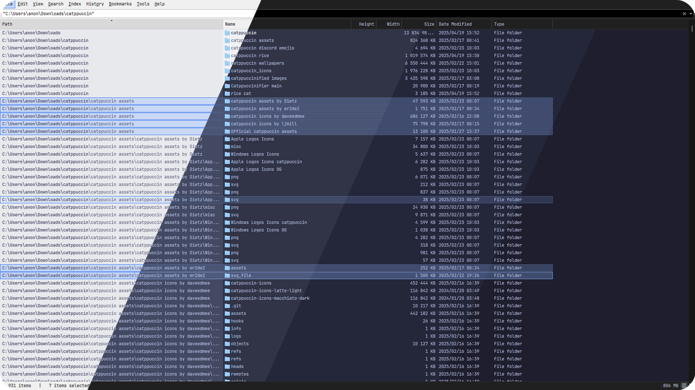
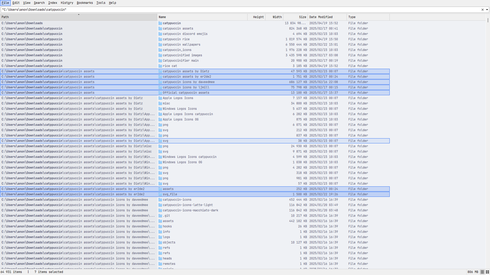
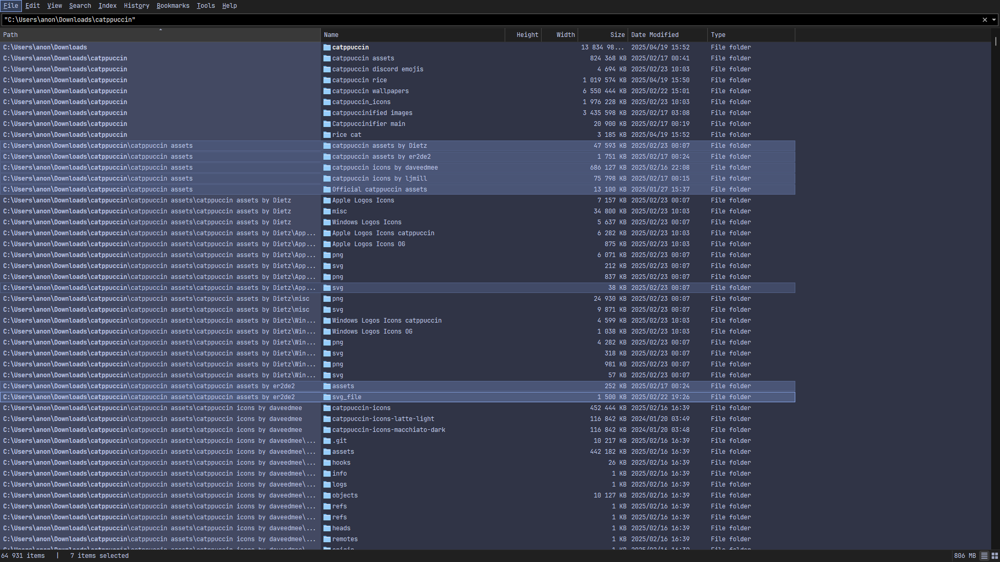
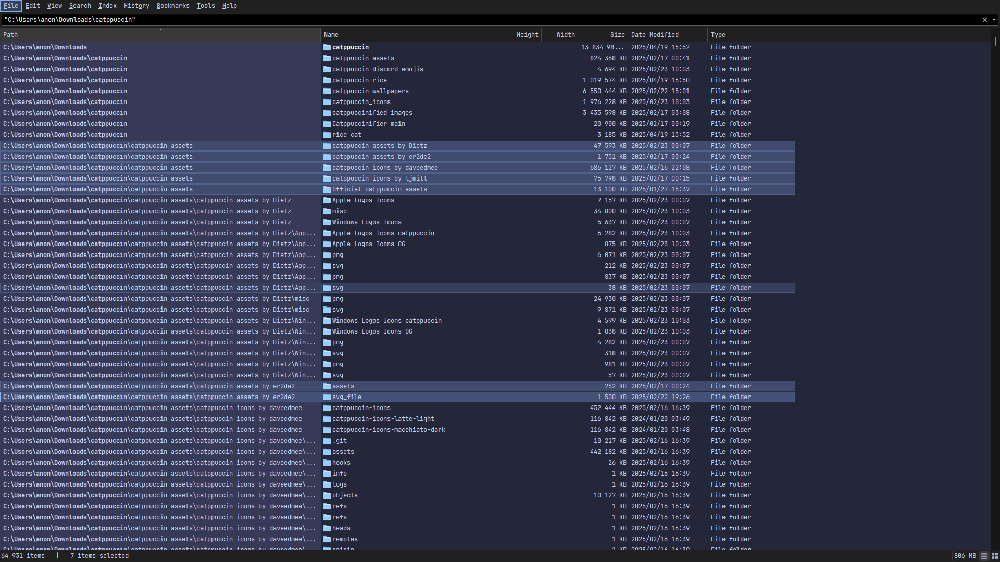
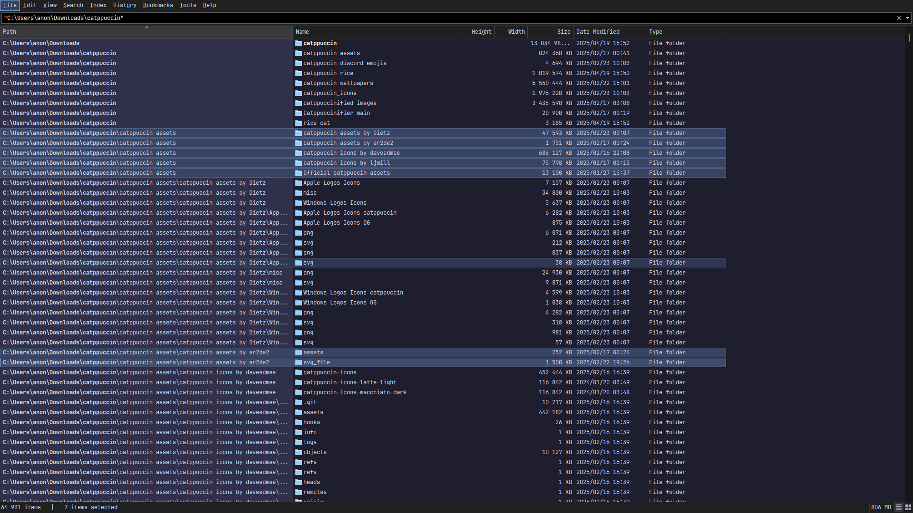

<h3 align="center">
	 
	
	Catppuccin for <a href="https://www.voidtools.com/everything-1.5a/">Everything 1.5 Alpha</a>
	
</h3>

	
	
	

	

## Previews

🌻 Latte

🪴 Frappé

🌺 Macchiato

🌿 Mocha

## Usage

1. Open **Everything 1.5**.
2. Go to the theme styling readme of your desired flavor (<a href="./themes/latte/Latte_EverythingTheme.md">Latte</a>, <a href="./themes/frappe/Frappé_EverythingTheme.md">Frappé</a>, <a href="./themes/macchiato/Macchiato_EverythingTheme.md">Macchiato</a> or <a href="./themes/mocha/Mocha_EverythingTheme.md">Mocha</a>) & copy the theme string.
3. Paste it into the Everything search box and press **ENTER**.
4. (Optional) For further customization, go to **Tools > Options > Fonts and Colors**.
5. Choose `Custom` for Accent, Foreground & Background colors and use appropriate color values from your desired flavor section.
6. Click **Apply** then **OK** and enjoy your theme.
themes\mocha\Mocha_EverythingTheme.md
## 💝 Thanks to

- [Courage-1984](https://github.com/Courage-1984)

&nbsp;

	

	Copyright &copy; 2021-present <a href="https://github.com/catppuccin" target="_blank">Catppuccin Org</a>

	

