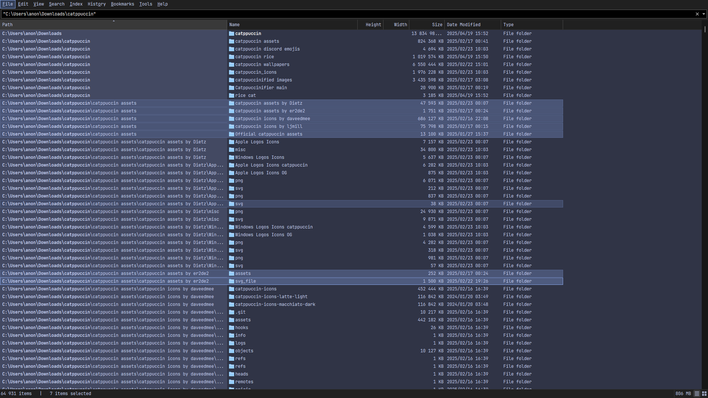

## Catppuccin 🪴 Frappé

1. Go to and select **View > Theme > Standard(Light)/Dark**.
2. Copy and paste this string into the Everything search box and press ENTER to apply the theme.

```
/theme=2;listview_item_margin_bottom=1;dark_accent=1;dark_accent_color=#8caaee;selected_border=1;dark_selected_border_color=#8caaee;dark_highlight_background_color=#626880;dark_highlight_foreground_color=#c6d0f5;dark_translucent_selection_rectangle_background_color=#303446;dark_translucent_selection_rectangle_border_color=#8caaee
```

### Foreground, Background & Accent Colors
<table>
	<tr>
		<th></th>
		<th>Labels</th>
		<th>UI Option</th>
		<th>Hex</th>
		<th>RGB</th>
		<th>HSL</th>
	</tr>
	<tr>
		<td></td>
		<td>Text</td>
		<td>Foreground</td>
		<td><code>#c6d0f5</code></td>
		<td><code>rgb(198, 208, 245)</code></td>
		<td><code>hsl(227, 70%, 87%)</code></td>
	</tr>
	<tr>
		<td></td>
		<td>Base</td>
		<td>Background</td>
		<td><code>#303446</code></td>
		<td><code>rgb(48, 52, 70)</code></td>
		<td><code>hsl(229, 19%, 23%)</code></td>
	</tr>
	<tr>
		<td></td>
		<td>Blue</td>
		<td>Accent</td>
		<td><code>#8caaee</code></td>
		<td><code>rgb(140, 170, 238)</code></td>
		<td><code>hsl(222, 74%, 74%)</code></td>
	</tr>
</table>

### Preview:

<p align="center">
	
</p>