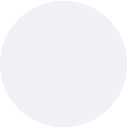
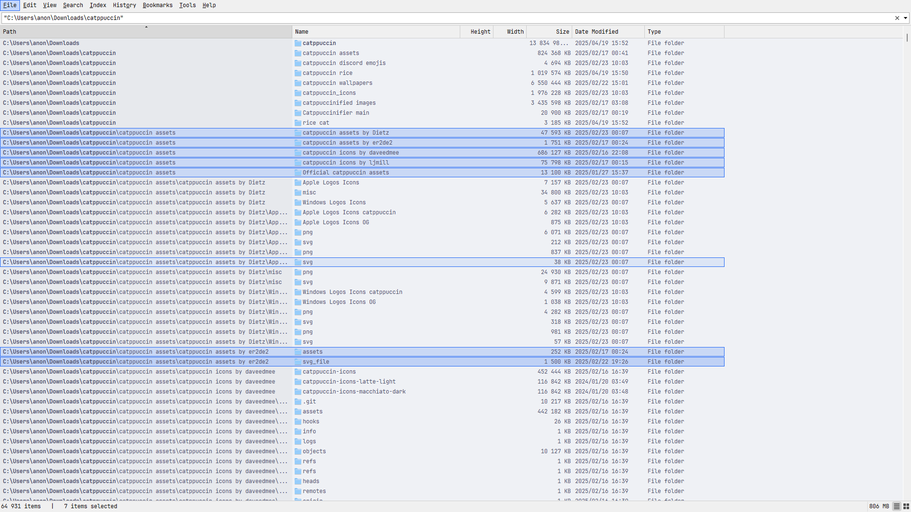

## Catppuccin 🌻 Latte

1. Go to and select **View > Theme > Standard(Light)/Dark**.
2. Copy and paste this string into the Everything search box and press ENTER to apply the theme.

```
/theme=1;listview_item_margin_bottom=1;accent=1;accent_color=#1e66f5;selected_border=1;selected_border_color=#1e66f5;highlight_background_color=#acb0be;highlight_foreground_color=#4c4f69;translucent_selection_rectangle_background_color=#eff1f5;translucent_selection_rectangle_border_color=#1e66f5
```

### Foreground, Background & Accent Colors
<table>
	<tr>
		<th></th>
		<th>Labels</th>
		<th>UI Option</th>
		<th>Hex</th>
		<th>RGB</th>
		<th>HSL</th>
	</tr>
	<tr>
		<td></td>
		<td>Text</td>
		<td>Foreground</td>
		<td><code>#4c4f69</code></td>
		<td><code>rgb(76, 79, 105)</code></td>
		<td><code>hsl(234, 16%, 36%)</code></td>
	</tr>
	<tr>
		<td></td>
		<td>Base</td>
		<td>Background</td>
		<td><code>#eff1f5</code></td>
		<td><code>rgb(239, 241, 245)</code></td>
		<td><code>hsl(220, 23%, 95%)</code></td>
	</tr>
	<tr>
		<td></td>
		<td>Blue</td>
		<td>Accent</td>
		<td><code>#1e66f5</code></td>
		<td><code>rgb(30, 102, 245)</code></td>
		<td><code>hsl(220, 91%, 54%)</code></td>
	</tr>
</table>

### Preview:

<p align="center">
	
</p>