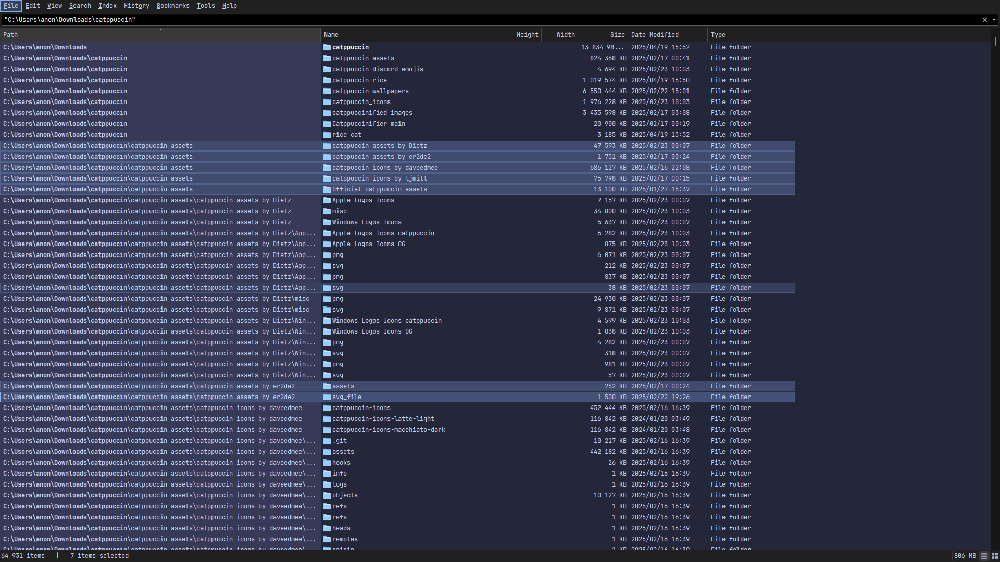

## Catppuccin 🌺 Macchiato

1. Go to and select **View > Theme > Standard(Light)/Dark**.
2. Copy and paste this string into the Everything search box and press ENTER to apply the theme.

```
/theme=2;listview_item_margin_bottom=1;dark_accent=1;dark_accent_color=#8aadf4;selected_border=1;dark_selected_border_color=#8aadf4;dark_highlight_background_color=#5b6078;dark_highlight_foreground_color=#cad3f5;dark_translucent_selection_rectangle_background_color=#24273a;dark_translucent_selection_rectangle_border_color=#8aadf4
```

### Foreground, Background & Accent Colors
<table>
	<tr>
		<th></th>
		<th>Labels</th>
		<th>UI Option</th>
		<th>Hex</th>
		<th>RGB</th>
		<th>HSL</th>
	</tr>
	<tr>
		<td></td>
		<td>Text</td>
		<td>Foreground</td>
		<td><code>#cad3f5</code></td>
		<td><code>rgb(202, 211, 245)</code></td>
		<td><code>hsl(227, 68%, 88%)</code></td>
	</tr>
	<tr>
		<td></td>
		<td>Base</td>
		<td>Background</td>
		<td><code>#24273a</code></td>
		<td><code>rgb(36, 39, 58)</code></td>
		<td><code>hsl(232, 24%, 18%)</code></td>
	</tr>
	<tr>
		<td></td>
		<td>Blue</td>
		<td>Accent</td>
		<td><code>#8aadf4</code></td>
		<td><code>rgb(138, 173, 244)</code></td>
		<td><code>hsl(220, 83%, 75%)</code></td>
	</tr>
</table>

### Preview:

<p align="center">
	
</p>