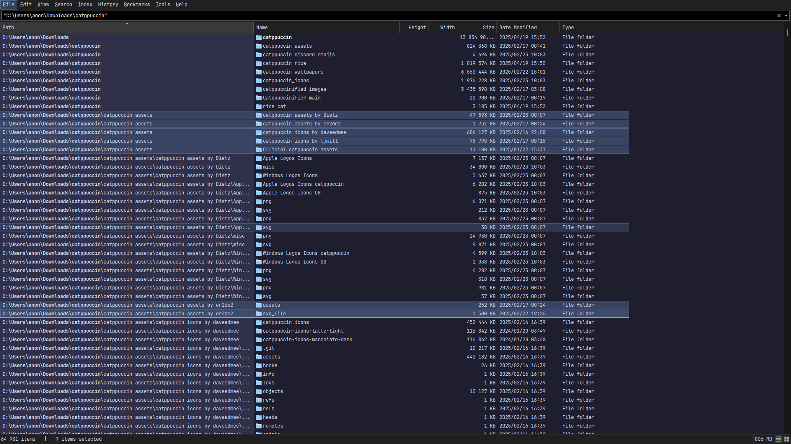

## Catppuccin 🌿 Mocha

1. Go to and select **View > Theme > Standard(Light)/Dark**.
2. Copy and paste this string into the Everything search box and press ENTER to apply the theme.

```
/theme=2;listview_item_margin_bottom=1;dark_accent=1;dark_accent_color=#89b4fa;selected_border=1;dark_selected_border_color=#89b4fa;dark_highlight_background_color=#585b70;dark_highlight_foreground_color=#cdd6f4;dark_translucent_selection_rectangle_background_color=#1e1e2e;dark_translucent_selection_rectangle_border_color=#89b4fa
```

### Foreground, Background & Accent Colors
<table>
	<tr>
		<th></th>
		<th>Labels</th>
		<th>UI Option</th>
		<th>Hex</th>
		<th>RGB</th>
		<th>HSL</th>
	</tr>
	<tr>
		<td></td>
		<td>Text</td>
		<td>Foreground</td>
		<td><code>#cdd6f4</code></td>
		<td><code>rgb(205, 214, 244)</code></td>
		<td><code>hsl(226, 64%, 88%)</code></td>
	</tr>
	<tr>
		<td></td>
		<td>Base</td>
		<td>Background</td>
		<td><code>#1e1e2e</code></td>
		<td><code>rgb(30, 30, 46)</code></td>
		<td><code>hsl(240, 21%, 15%)</code></td>
	</tr>
	<tr>
		<td></td>
		<td>Blue</td>
		<td>Accent</td>
		<td><code>#89b4fa</code></td>
		<td><code>rgb(137, 180, 250)</code></td>
		<td><code>hsl(217, 92%, 76%)</code></td>
	</tr>
</table>

### Preview:

<p align="center">
	
</p>